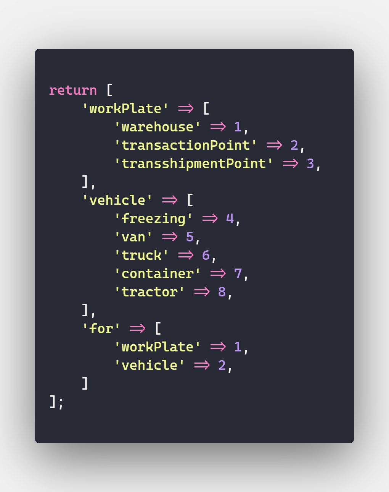
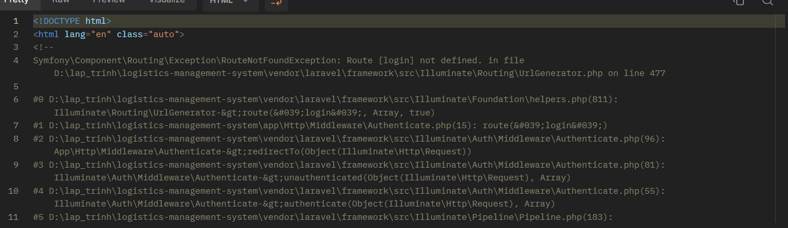

# API DOCUMENT

## Base URL
`http://localhost:8000/api`

## Tag 
> - `AUTH`: can co 1 truong trong header: `Authorization: Bearer {token}`  
> - `Admin`: Account Admin

## Type


## CSRF Token `AUTH`
`GET`: `/token`
>- Lấy csrf token của phiên hiện tại.  
>- Cần thêm trường `_token` vào mỗi requset gửi lên.

### Response
```
{
    "token": "Cl6MrILAOrVW0gvhrd68k8Uv1pYKzkzjAHUDtdWj"
}
```

## Register ###
> `POST` : `/users`  

### Cac truong yeu cau:  
> `name`: required  
> `username`: required    
> `password`: required | min:8 | chua chu va so  
> `password_confirmation`: required | giong password  
#### VD:  
> `name`: test  
> `username`: username  
> `password`: password1  
> `password_confirmation`: password1

## Response
### Success
```
{
    "success": true,
    "data": {
        "name": "test",
        "username": "username26",
        "role_id": 3,
        "updated_at": 1710439777,
        "created_at": 1710439777,
        "id": 1
    },
    "message": "create User success"
}
```
### Error
```
{
    "success": false,
    "error": {
        "name": [
            "The name field is required."
        ],
        "username": [
            "The username field is required."
        ],
        "dob": [
            "The dob field is required."
        ],
        "password": [
            "The password field is required."
        ],
        "email": [
            "The email field is required."
        ]
    },
    "status_code": 422
}
```
## Login
> `POST`: `users/login`
### Cac truong yeu cau
> `username`: required  
> `password`: required

### Response
#### Success
```
{
    "success": true,
    "data": {
        "user": {
            "id": 1,
            "name": "test",
            "email": null,
            "email_verified_at": null,
            "created_at": "2024-03-23 06:00:33",
            "updated_at": "2024-03-23 06:00:33",
            "phone": null,
            "dob": null,
            "username": "username",
            "address": null,
            "role_id": 2,
            "wp_id": null,
            "img_id": null,
            "role": {
                "id": 2,
                "name": "User",
                "desc": "User",
                "created_at": "2024-03-22T17:37:12.000000Z",
                "updated_at": "2024-03-22T17:37:12.000000Z"
            },
            "work_plate": null,
            "img": null
        },
        "token": "3|VmMe6ejKCQzNuRCflJsGqTgD0clTu38RIMYkXvQIc0f88ec0",
    },
    "message": "User login successfully."
}
```
#### Error
```
{
    "success": false,
    "error": {
        "username": [
            "The username field is required."
        ],
        "password": [
            "The password field is required."
        ]
    },
    "status_code": 422
}
```
## Logout `AUTH`
`DELETE`: `users/me`
### Response
```
{
    "success": true,
    "data": [],
    "message": "logout success"
}
```
```
HTTP status code 500
```

## Get user info `AUTH` 
`GET`: `users/:id` 

> `id` id cua user muon xem vs admin | id ban than  

### Response
### Success
```
{
    "success": true,
    "data": {
        "id": 1,
        "name": "Lysanne Deckow IV",
        "email": "admin@admin.com",
        "email_verified_at": null,
        "created_at": null,
        "updated_at": "2024-04-24T18:58:03.000000Z",
        "phone": "+1-270-765-894",
        "dob": "2024/07/10",
        "username": "admin",
        "role_id": 1,
        "wp_id": 1,
        "img_id": null,
        "address": {
            "provinceCode": "79",
            "districtCode": "773",
            "wardCode": "27298",
            "province": "Thành phố Hồ Chí Minh",
            "district": "Quận 4",
            "ward": "Phường 01",
            "address": "hn"
        },
        "role": {
            "id": 1,
            "name": "Admin",
            "desc": "Admin",
            "created_at": "2024-04-24T17:43:35.000000Z",
            "updated_at": "2024-04-24T17:43:35.000000Z"
        },
        "work_plate": {
            "id": 1,
            "name": "DQyWw9Xf1S",
            "type_id": 2,
            "created_at": "2024-04-24T17:43:52.000000Z",
            "updated_at": "2024-04-24T17:43:52.000000Z",
            "cap": "3",
            "vung": "27280",
            "address": {
                "provinceCode": "79",
                "districtCode": "773",
                "wardCode": "27280",
                "province": "Thành phố Hồ Chí Minh",
                "district": "Quận 4",
                "ward": "Phường 14",
                "address": ""
            },
            "manager": {
                "id": 5,
                "name": "Roberto Emard",
                "address": null,
                "role": null
            }
        },
        "img": null,
        "vehicle": null
    },
    "message": "Send user"
}
```
### Fail


## Update info user `AUTH`
`PUT`: `users\{id}`
>`name`: string  
>`dob`: date  
>`email`: email  
>`phone`: string
>`address`: string
>`address_id`: string wardId
>`image`: image
>`wp_id`: exist:wp

### Response
```
{
    "success": true,
    "data": {
        "id": 1,
        "name": "Lysanne Deckow IV",
        "email": "admin@admin.com",
        "email_verified_at": null,
        "created_at": null,
        "updated_at": "2024-04-24T18:58:03.000000Z",
        "phone": "+1-270-765-894",
        "dob": "2024/07/10",
        "username": "admin",
        "role_id": 1,
        "wp_id": 1,
        "img_id": null,
        "address": {
            "provinceCode": "79",
            "districtCode": "773",
            "wardCode": "27298",
            "province": "Thành phố Hồ Chí Minh",
            "district": "Quận 4",
            "ward": "Phường 01",
            "address": "hn"
        },
        "role": {
            "id": 1,
            "name": "Admin",
            "desc": "Admin",
            "created_at": "2024-04-24T17:43:35.000000Z",
            "updated_at": "2024-04-24T17:43:35.000000Z"
        },
        "work_plate": {
            "id": 1,
            "name": "DQyWw9Xf1S",
            "address_id": "27280",
            "type_id": 2,
            "created_at": "2024-04-24T17:43:52.000000Z",
            "updated_at": "2024-04-24T17:43:52.000000Z",
            "cap": "3",
            "vung": "27280",
            "address": {
                "provinceCode": "79",
                "districtCode": "773",
                "wardCode": "27280",
                "province": "Thành phố Hồ Chí Minh",
                "district": "Quận 4",
                "ward": "Phường 14"
            },
            "manager": {
                "id": 5,
                "name": "Roberto Emard",
                "address": null,
                "role": null
            }
        },
        "img": null,
        "vehicle": null
    },
    "message": "update user success"
}
```
```
{
    "success": false,
    "error": {
        "email": [
            "The email field must be a valid email address."
        ]
    },
    "status_code": 422
}
```

## Change WP `AUTH` `Admin`
`PUT` `users\{id}\change-wp`

> `wp_id`: required|exists:work_palates,id
### Response
```
{
    "success": true,
    "data": {
        "id": 1,
        "name": "test",
        "email": null,
        "email_verified_at": null,
        "created_at": "2024-03-22 06:21:32",
        "updated_at": "2024-03-22 06:23:48",
        "phone": null,
        "dob": null,
        "username": "username",
        "address": null,
        "role_id": 1,
        "wp_id": 1,
        "img_id": null
    },
    "message": "change WP success"
}
```
```
{
    "success": false,
    "error": {
        "wp_id": [
            "The selected wp id is invalid."
        ]
    },
    "status_code": 422
}
```


## Get list Account `AUTH` `ADMIN` `MANAGER`
`GET` `users\`  
Param
>`page`: number|min:1  
>`pageSize`: number|min:1  
>`role`: roleId

### Response
```
{
    "success": true,
    "data": {
        "total": 1,
        "currentPage": 1,
        "pageSize": 3,
        "data": [
            {
                "id": 4,
                "name": "Prof. Kaela Dickinson",
                "email": "employee@admin.com",
                "email_verified_at": null,
                "created_at": null,
                "updated_at": null,
                "phone": "248-446-3183",
                "dob": "2024/04/25",
                "username": "employee",
                "role_id": 4,
                "wp_id": 1,
                "img_id": null,
                "address": {
                    "provinceCode": "79",
                    "districtCode": "773",
                    "wardCode": "27298",
                    "province": "Thành phố Hồ Chí Minh",
                    "district": "Quận 4",
                    "ward": "Phường 01",
                    "address": ""
                },
                "role": {
                    "id": 4,
                    "name": "Employee",
                    "desc": "Employee",
                    "created_at": "2024-04-24T17:43:35.000000Z",
                    "updated_at": "2024-04-24T17:43:35.000000Z"
                },
                "work_plate": {
                    "id": 1,
                    "name": "DQyWw9Xf1S",
                    "type_id": 2,
                    "created_at": "2024-04-24T17:43:52.000000Z",
                    "updated_at": "2024-04-24T17:43:52.000000Z",
                    "cap": "3",
                    "vung": "27280",
                    "address": {
                        "provinceCode": "79",
                        "districtCode": "773",
                        "wardCode": "27280",
                        "province": "Thành phố Hồ Chí Minh",
                        "district": "Quận 4",
                        "ward": "Phường 14",
                        "address": ""
                    },
                    "manager": {
                        "id": 5,
                        "name": "Roberto Emard",
                        "address": null,
                        "role": null
                    }
                },
                "vehicle": null,
                "img": null
            }
        ]
    },
    "message": "success"
}
```

### Get list user `AUTH` `ADMIN`
`GET` `usres/lists/uesrs`

>`page`: number|min:1  
>`pageSize`: number|min:1  
#### Response
```
{
    "success": true,
    "data": {
        "total": 11,
        "currentPage": 1,
        "pageSize": 12,
        "data": [
            {
                "id": 3,
                "name": "Morton Hayes",
                "email": "user@admin.com",
                "email_verified_at": null,
                "created_at": null,
                "updated_at": null,
                "phone": "1-219-213-2504",
                "dob": "2024/04/25",
                "username": "user",
                "role_id": 2,
                "wp_id": 1,
                "img_id": null,
                "address": {
                    "provinceCode": "79",
                    "districtCode": "773",
                    "wardCode": "27298",
                    "province": "Thành phố Hồ Chí Minh",
                    "district": "Quận 4",
                    "ward": "Phường 01",
                    "address": ""
                },
                "role": {
                    "id": 2,
                    "name": "User",
                    "desc": "User",
                    "created_at": "2024-04-24T17:43:35.000000Z",
                    "updated_at": "2024-04-24T17:43:35.000000Z"
                },
                "img": null
            },
            {
                "id": 6,
                "name": "Dr. Coralie Keeling Jr.",
                "email": "ernie64@example.com",
                "email_verified_at": "2024/04/25 00:43",
                "created_at": "2024-04-24T17:43:52.000000Z",
                "updated_at": "2024-04-24T17:43:52.000000Z",
                "phone": "+1 (317) 612-3035",
                "dob": "2024/04/25",
                "username": "keaton38",
                "role_id": 2,
                "wp_id": null,
                "img_id": null,
                "address": {
                    "provinceCode": "51",
                    "districtCode": "529",
                    "wardCode": "21319",
                    "province": "Tỉnh Quảng Ngãi",
                    "district": "Huyện Sơn Hà",
                    "ward": "Xã Sơn Hải",
                    "address": ""
                },
                "role": {
                    "id": 2,
                    "name": "User",
                    "desc": "User",
                    "created_at": "2024-04-24T17:43:35.000000Z",
                    "updated_at": "2024-04-24T17:43:35.000000Z"
                },
                "img": null
            },
            {
                "id": 7,
                "name": "Gussie Moen",
                "email": "serena.yundt@example.net",
                "email_verified_at": "2024/04/25 00:43",
                "created_at": "2024-04-24T17:43:52.000000Z",
                "updated_at": "2024-04-24T17:43:52.000000Z",
                "phone": "+1.234.602.4264",
                "dob": "2024/04/25",
                "username": "claire45",
                "role_id": 2,
                "wp_id": null,
                "img_id": null,
                "address": {
                    "provinceCode": "40",
                    "districtCode": "430",
                    "wardCode": "17968",
                    "province": "Tỉnh Nghệ An",
                    "district": "Huyện Nam Đàn",
                    "ward": "Xã Thượng Tân Lộc",
                    "address": ""
                },
                "role": {
                    "id": 2,
                    "name": "User",
                    "desc": "User",
                    "created_at": "2024-04-24T17:43:35.000000Z",
                    "updated_at": "2024-04-24T17:43:35.000000Z"
                },
                "img": null
            },
            {
                "id": 8,
                "name": "Dr. Karlie Fahey II",
                "email": "fisher.freeman@example.org",
                "email_verified_at": "2024/04/25 00:43",
                "created_at": "2024-04-24T17:43:52.000000Z",
                "updated_at": "2024-04-24T17:43:52.000000Z",
                "phone": "+1 (484) 345-1793",
                "dob": "2024/04/25",
                "username": "lambert.sanford",
                "role_id": 2,
                "wp_id": null,
                "img_id": null,
                "address": {
                    "provinceCode": "14",
                    "districtCode": "120",
                    "wardCode": "03814",
                    "province": "Tỉnh Sơn La",
                    "district": "Huyện Mường La",
                    "ward": "Xã Chiềng Lao",
                    "address": ""
                },
                "role": {
                    "id": 2,
                    "name": "User",
                    "desc": "User",
                    "created_at": "2024-04-24T17:43:35.000000Z",
                    "updated_at": "2024-04-24T17:43:35.000000Z"
                },
                "img": null
            },
            {
                "id": 9,
                "name": "Robert Muller",
                "email": "ubosco@example.net",
                "email_verified_at": "2024/04/25 00:43",
                "created_at": "2024-04-24T17:43:52.000000Z",
                "updated_at": "2024-04-24T17:43:52.000000Z",
                "phone": "(561) 591-8091",
                "dob": "2024/04/25",
                "username": "tony18",
                "role_id": 2,
                "wp_id": null,
                "img_id": null,
                "address": {
                    "provinceCode": "36",
                    "districtCode": "360",
                    "wardCode": "13828",
                    "province": "Tỉnh Nam Định",
                    "district": "Huyện Ý Yên",
                    "ward": "Xã Yên Phú",
                    "address": ""
                },
                "role": {
                    "id": 2,
                    "name": "User",
                    "desc": "User",
                    "created_at": "2024-04-24T17:43:35.000000Z",
                    "updated_at": "2024-04-24T17:43:35.000000Z"
                },
                "img": null
            },
            {
                "id": 10,
                "name": "Prof. Alexandre Grimes",
                "email": "schaden.edyth@example.net",
                "email_verified_at": "2024/04/25 00:43",
                "created_at": "2024-04-24T17:43:52.000000Z",
                "updated_at": "2024-04-24T17:43:52.000000Z",
                "phone": "(320) 633-4760",
                "dob": "2024/04/25",
                "username": "becker.carlos",
                "role_id": 2,
                "wp_id": null,
                "img_id": null,
                "address": {
                    "provinceCode": "51",
                    "districtCode": "525",
                    "wardCode": "21127",
                    "province": "Tỉnh Quảng Ngãi",
                    "district": "Huyện Trà Bồng",
                    "ward": "Xã Trà Bình",
                    "address": ""
                },
                "role": {
                    "id": 2,
                    "name": "User",
                    "desc": "User",
                    "created_at": "2024-04-24T17:43:35.000000Z",
                    "updated_at": "2024-04-24T17:43:35.000000Z"
                },
                "img": null
            },
            {
                "id": 11,
                "name": "Ian Hessel V",
                "email": "aida.hyatt@example.org",
                "email_verified_at": "2024/04/25 00:43",
                "created_at": "2024-04-24T17:43:52.000000Z",
                "updated_at": "2024-04-24T17:43:52.000000Z",
                "phone": "689.421.1938",
                "dob": "2024/04/25",
                "username": "torphy.wellington",
                "role_id": 2,
                "wp_id": null,
                "img_id": null,
                "address": {
                    "provinceCode": "38",
                    "districtCode": "380",
                    "wardCode": "15850",
                    "province": "Tỉnh Thanh Hóa",
                    "district": "Thành phố Thanh Hóa",
                    "ward": "Xã Thiệu Vân",
                    "address": ""
                },
                "role": {
                    "id": 2,
                    "name": "User",
                    "desc": "User",
                    "created_at": "2024-04-24T17:43:35.000000Z",
                    "updated_at": "2024-04-24T17:43:35.000000Z"
                },
                "img": null
            },
            {
                "id": 12,
                "name": "Jarrett Jakubowski",
                "email": "dena.christiansen@example.org",
                "email_verified_at": "2024/04/25 00:43",
                "created_at": "2024-04-24T17:43:52.000000Z",
                "updated_at": "2024-04-24T17:43:52.000000Z",
                "phone": "283-943-6812",
                "dob": "2024/04/25",
                "username": "florine11",
                "role_id": 2,
                "wp_id": null,
                "img_id": null,
                "address": {
                    "provinceCode": "60",
                    "districtCode": "593",
                    "wardCode": "22945",
                    "province": "Tỉnh Bình Thuận",
                    "district": "Thành phố Phan Thiết",
                    "ward": "Phường Lạc Đạo",
                    "address": ""
                },
                "role": {
                    "id": 2,
                    "name": "User",
                    "desc": "User",
                    "created_at": "2024-04-24T17:43:35.000000Z",
                    "updated_at": "2024-04-24T17:43:35.000000Z"
                },
                "img": null
            },
            {
                "id": 13,
                "name": "Bernadette Hermiston MD",
                "email": "jwindler@example.com",
                "email_verified_at": "2024/04/25 00:43",
                "created_at": "2024-04-24T17:43:52.000000Z",
                "updated_at": "2024-04-24T17:43:52.000000Z",
                "phone": "(743) 380-8425",
                "dob": "2024/04/25",
                "username": "nathaniel39",
                "role_id": 2,
                "wp_id": null,
                "img_id": null,
                "address": {
                    "provinceCode": "84",
                    "districtCode": "850",
                    "wardCode": "29521",
                    "province": "Tỉnh Trà Vinh",
                    "district": "Huyện Duyên Hải",
                    "ward": "Xã Long Khánh",
                    "address": ""
                },
                "role": {
                    "id": 2,
                    "name": "User",
                    "desc": "User",
                    "created_at": "2024-04-24T17:43:35.000000Z",
                    "updated_at": "2024-04-24T17:43:35.000000Z"
                },
                "img": null
            },
            {
                "id": 14,
                "name": "Mrs. Hattie Gottlieb",
                "email": "edna.damore@example.net",
                "email_verified_at": "2024/04/25 00:43",
                "created_at": "2024-04-24T17:43:52.000000Z",
                "updated_at": "2024-04-24T17:43:52.000000Z",
                "phone": "+16202138535",
                "dob": "2024/04/25",
                "username": "lueilwitz.eula",
                "role_id": 2,
                "wp_id": null,
                "img_id": null,
                "address": {
                    "provinceCode": "19",
                    "districtCode": "169",
                    "wardCode": "05689",
                    "province": "Tỉnh Thái Nguyên",
                    "district": "Huyện Đồng Hỷ",
                    "ward": "Xã Cây Thị",
                    "address": ""
                },
                "role": {
                    "id": 2,
                    "name": "User",
                    "desc": "User",
                    "created_at": "2024-04-24T17:43:35.000000Z",
                    "updated_at": "2024-04-24T17:43:35.000000Z"
                },
                "img": null
            },
            {
                "id": 15,
                "name": "Nelson Daugherty",
                "email": "hahn.doris@example.org",
                "email_verified_at": "2024/04/25 00:43",
                "created_at": "2024-04-24T17:43:52.000000Z",
                "updated_at": "2024-04-24T17:43:52.000000Z",
                "phone": "402.898.7751",
                "dob": "2024/04/25",
                "username": "veum.jordan",
                "role_id": 2,
                "wp_id": null,
                "img_id": null,
                "address": {
                    "provinceCode": "40",
                    "districtCode": "420",
                    "wardCode": "17053",
                    "province": "Tỉnh Nghệ An",
                    "district": "Huyện Quỳ Hợp",
                    "ward": "Xã Liên Hợp",
                    "address": ""
                },
                "role": {
                    "id": 2,
                    "name": "User",
                    "desc": "User",
                    "created_at": "2024-04-24T17:43:35.000000Z",
                    "updated_at": "2024-04-24T17:43:35.000000Z"
                },
                "img": null
            }
        ]
    },
    "message": "success"
}
```
```
{
    "success": false,
    "message": "Access denied"
}
```


### Delete Employee `AUTH` `ADMIN` `MANAGER`
`DELETE`: `users/{id}`
#### Response 
```
{
    "success": true,
    "data": "",
    "message": "delete success"
}
```
```
http status 404
```
```
http status 403
{
    "success": false,
    "message": "Access denied"
}
```

### Create employee account `AUTH` `ADMIN|MANAGER`
`POST`: `users/create/employee`

> `name`: required  
> `email`: required|email  
> `phone`: required  
> `dob`: date  
> `username`: required  
> `address_id`: required
> `address`: required
> `image`: image  
> only admin can change:  
> `role_id`
> `wp_id`
#### Response
```
{
    "success": true,
    "data": {
        "username": "test",
        "email": "test@admin.com",
        "phone": "0123456789",
        "name": "test",
        "address_id": "27280",
        "role_id": 4,
        "wp_id": 1,
        "updated_at": "2024-04-08T16:38:10.000000Z",
        "created_at": "2024-04-08T16:38:10.000000Z",
        "id": 26,
        "address": {
            "provinceCode": "79",
            "districtCode": "773",
            "wardCode": "27280",
            "province": "Thành phố Hồ Chí Minh",
            "district": "Quận 4",
            "ward": "Phường 14"
        },
        "role": {
            "id": 4,
            "name": "Employee",
            "desc": "Employee",
            "created_at": "2024-04-08T16:21:30.000000Z",
            "updated_at": "2024-04-08T16:21:30.000000Z"
        },
        "work_plate": {
            "id": 1,
            "name": "YKxjEiyVko",
            "address_id": "27280",
            "type_id": 2,
            "created_at": "2024-04-08T16:21:35.000000Z",
            "updated_at": "2024-04-08T16:21:35.000000Z",
            "cap": "3",
            "vung": "27280",
            "address": {
                "provinceCode": "79",
                "districtCode": "773",
                "wardCode": "27280",
                "province": "Thành phố Hồ Chí Minh",
                "district": "Quận 4",
                "ward": "Phường 14"
            }
        },
        "img": null
    },
    "message": "create employee success"
}
```

## Change Password `AUTH`
`PUT`: `users\change-password`

> `old_password` required  
> `new_password` required, min:8, letters, numbers, mixLetter, confirmed

### Response
```
{
    "success": true,
    "data": {
        "id": 1,
        "name": "Ewell Heller",
        "email": "admin@admin.com",
        "email_verified_at": null,
        "created_at": null,
        "updated_at": "2024-04-11T12:39:02.000000Z",
        "phone": "+1-239-946-9272",
        "dob": "2024/04/10",
        "username": "admin",
        "address_id": "27280",
        "role_id": 1,
        "wp_id": 1,
        "img_id": 2,
        "address": {
            "provinceCode": "79",
            "districtCode": "773",
            "wardCode": "27280",
            "province": "Thành phố Hồ Chí Minh",
            "district": "Quận 4",
            "ward": "Phường 14"
        }
    },
    "message": "change Password success"
}
```
```
{
    "success": false,
    "error": [
        {
            "field": "old_password",
            "message": [
                "The old password field is required."
            ]
        },
        {
            "field": "new_password",
            "message": [
                "The new password field is required."
            ]
        }
    ],
    "status_code": 422
}
```

## Image
### GetImage
`get`: `images/{id}`  
### Response
#### Success
> file Image
#### Fail
> http code `404`

### Upload Image
`post`: `images`
>`image`: required, image
#### Response
```
{
    "link": "http://localhost:8000/api/images/2"
}
```
## Work Plate
### Create `AUTH` `ADMIN`
`POST` `\work-plates`

#### Cac truong yeu cau:
> - name: required
> - address_id: required|string
> - address: required|string
> - type_id: required|numeric
> - cap: required|numeric|in(1,2,3)  
> - max_payload: numeric


> 1,2,3: ward, district, province
#### Response
```
{
    "success": true,
    "data": {
        "name": "test",
        "type_id": "1",
        "cap": "1",
        "vung": "27280",
        "updated_at": "2024-04-24T19:38:02.000000Z",
        "created_at": "2024-04-24T19:38:02.000000Z",
        "id": 18,
        "address": {
            "provinceCode": "79",
            "districtCode": "773",
            "wardCode": "27280",
            "province": "Thành phố Hồ Chí Minh",
            "district": "Quận 4",
            "ward": "Phường 14",
            "address": "hn"
        },
        "manager": null
    },
    "message": "WorkPlate create success"
}
```
```
{
    "success": false,
    "error": [
        {
            "field": "address_id",
            "message": [
                "The address id field is required."
            ]
        },
        {
            "field": "type_id",
            "message": [
                "The type id field is required."
            ]
        }
    ],
    "status_code": 422
}
```

### Get info `AUTH`
`GET` `\work-plates\{id}`

#### Response
```
{
    "success": true,
    "data": {
        "id": 18,
        "name": "test",
        "type_id": 1,
        "created_at": "2024-04-24T19:38:02.000000Z",
        "updated_at": "2024-04-24T19:38:02.000000Z",
        "cap": "1",
        "vung": "27280",
        "address": {
            "provinceCode": "79",
            "districtCode": "773",
            "wardCode": "27280",
            "province": "Thành phố Hồ Chí Minh",
            "district": "Quận 4",
            "ward": "Phường 14",
            "address": "hn"
        },
        "manager": null,
        "detail": null,
        "type": {
            "id": 1,
            "name": "warehouse",
            "for": 1
        }
    },
    "message": "Get success"
}
```
```
HTTP code 404
```
### Get List WP `AUTH` `ADMIN` `MANAGER` `EMPLOYEE` 
`GET` `work-plates`

>`page`: number|min:1  
>`pageSize`: number|min:1  
> `type_id`: 1,2,3

#### Response
```
{
    "success": true,
    "data": {
        "total": 16,
        "currentPage": 2,
        "pageSize": 12,
        "data": [
            {
                "id": 13,
                "name": "Miss Clare Stracke Sr.",
                "cap": 3,
                "created_at": "2024-04-25T15:17:29.000000Z",
                "updated_at": "2024-04-25T15:17:29.000000Z",
                "type_id": 2,
                "address": {
                    "provinceCode": "40",
                    "districtCode": "424",
                    "wardCode": "17359",
                    "province": "Tỉnh Nghệ An",
                    "district": "Huyện Anh Sơn",
                    "ward": "Xã Tào Sơn",
                    "address": "test"
                },
                "manager": null,
                "type": {
                    "id": 2,
                    "name": "transactionPoint",
                    "for": 1
                },
                "detail": null
            },
            {
                "id": 14,
                "name": "Yasmin DuBuque I",
                "cap": 1,
                "created_at": "2024-04-25T15:17:29.000000Z",
                "updated_at": "2024-04-25T15:17:29.000000Z",
                "type_id": 1,
                "address": {
                    "provinceCode": "01",
                    "districtCode": "278",
                    "wardCode": "10135",
                    "province": "Thành phố Hà Nội",
                    "district": "Huyện Thanh Oai",
                    "ward": "Xã Bình Minh",
                    "address": "test"
                },
                "manager": null,
                "type": {
                    "id": 1,
                    "name": "warehouse",
                    "for": 1
                },
                "detail": {
                    "id": 3,
                    "wp_id": 14,
                    "max_payload": 4324,
                    "payload": 0,
                    "created_at": "2024-04-25T15:17:29.000000Z",
                    "updated_at": "2024-04-25T15:17:29.000000Z"
                }
            },
            {
                "id": 15,
                "name": "Dr. Vicente Lockman V",
                "cap": 3,
                "created_at": "2024-04-25T15:17:29.000000Z",
                "updated_at": "2024-04-25T15:17:29.000000Z",
                "type_id": 1,
                "address": {
                    "provinceCode": "37",
                    "districtCode": "370",
                    "wardCode": "14369",
                    "province": "Tỉnh Ninh Bình",
                    "district": "Thành phố Tam Điệp",
                    "ward": "Phường Tây Sơn",
                    "address": "test"
                },
                "manager": null,
                "type": {
                    "id": 1,
                    "name": "warehouse",
                    "for": 1
                },
                "detail": {
                    "id": 4,
                    "wp_id": 15,
                    "max_payload": 2843,
                    "payload": 0,
                    "created_at": "2024-04-25T15:17:29.000000Z",
                    "updated_at": "2024-04-25T15:17:29.000000Z"
                }
            },
            {
                "id": 16,
                "name": "Ms. Emely Gerhold",
                "cap": 2,
                "created_at": "2024-04-25T15:17:29.000000Z",
                "updated_at": "2024-04-25T15:17:29.000000Z",
                "type_id": 3,
                "address": {
                    "provinceCode": "44",
                    "districtCode": "458",
                    "wardCode": "19078",
                    "province": "Tỉnh Quảng Bình",
                    "district": "Thị xã Ba Đồn",
                    "ward": "Phường Quảng Phong",
                    "address": "test"
                },
                "manager": null,
                "type": {
                    "id": 3,
                    "name": "transshipmentPoint",
                    "for": 1
                },
                "detail": null
            }
        ]
    },
    "message": "Get list work plate success"
}
```
```
http status 403
```
```
{
    "success": false,
    "error": [
        {
            "field": "type_id",
            "message": [
                "The selected type id is invalid."
            ]
        }
    ],
    "status_code": 422
}
```

### Update WorkPlate `AUTH` `ADMIN`
`PUT`: `work-plates/{wpId}`
> name: string  
> address_id: string  
> address: string  
> type_id: numeric,
> max_payload: numeric  
> cap: muneric| 1 2 3

#### Response
```
{
    "success": true,
    "data": {
        "id": 19,
        "name": "test",
        "type_id": 1,
        "created_at": "2024-04-11T11:37:06.000000Z",
        "updated_at": "2024-04-11T11:37:06.000000Z",
        "cap": "3",
        "vung": "27280",
        "address": {
            "provinceCode": "79",
            "districtCode": "773",
            "wardCode": "27280",
            "province": "Thành phố Hồ Chí Minh",
            "district": "Quận 4",
            "ward": "Phường 14",
            "address":"hn"
        },
        "manager": null,
        "detail": {
            "id": 6,
            "wp_id": 19,
            "max_payload": 0,
            "payload": 0,
            "created_at": "2024-04-11T12:15:26.000000Z",
            "updated_at": "2024-04-11T12:15:26.000000Z"
        },
        "type": {
            "id": 1,
            "name": "warehouse",
            "for": 1
        }
    },
    "message": ""
}
```
```
{
    "success": false,
    "error": [
        {
            "field": "address_id",
            "message": [
                "The selected address_id is invalid."
            ]
        }
    ],
    "status_code": 422
}
```

### Get Suggestion WP `AUTH`
`GET`: `work-plates/suggestion-wp`

> `address_id`: required|string| address code valid
#### Response
```
{
    "success": true,
    "data": [
        [
            {
                "id": 1,
                "name": "FHkVuLD2yg",
                "address_id": "27280",
                "created_at": "2024-04-10T15:23:53.000000Z",
                "updated_at": "2024-04-10T15:23:53.000000Z",
                "type_id": 2,
                "address": {
                    "provinceCode": "79",
                    "districtCode": "773",
                    "wardCode": "27280",
                    "province": "Thành phố Hồ Chí Minh",
                    "district": "Quận 4",
                    "ward": "Phường 14"
                    "address":"hn"
                },
                "manager": {
                    "id": 5,
                    "name": "Prof. Seamus Cremin",
                    "address": null
                },
                "type": {
                    "id": 2,
                    "name": "transactionPoint",
                    "for": 1
                },
                "detail": {
                    "id": 3,
                    "wp_id": 1,
                    "max_payload": 123333,
                    "payload": 0,
                    "created_at": "2024-04-11T11:38:01.000000Z",
                    "updated_at": "2024-04-11T11:38:01.000000Z"
                }
            },
            {
                "id": 2,
                "name": "iVDjUP0IOS",
                "address_id": "27280",
                "created_at": "2024-04-10T15:23:53.000000Z",
                "updated_at": "2024-04-10T15:23:53.000000Z",
                "type_id": 3,
                "address": {
                    "provinceCode": "79",
                    "districtCode": "773",
                    "wardCode": "27280",
                    "province": "Thành phố Hồ Chí Minh",
                    "district": "Quận 4",
                    "ward": "Phường 14"
                    "address":"hn"
                },
                "manager": null,
                "type": {
                    "id": 3,
                    "name": "transshipmentPoint",
                    "for": 1
                },
                "detail": null
            }
        ]
    ],
    "message": "get suggestion wp success"
}
```
```
{
    "success": false,
    "error": [
        {
            "field": "address_id",
            "message": [
                "The address id field is required."
            ]
        }
    ],
    "status_code": 422
}
```

## Type `AUTH`
`GET` `types\{work-plates|vehicles}`

### Response
```
{
    "success": true,
    "data": [
        {
            "id": 1,
            "name": "warehouse",
            "for": 1
        },
        {
            "id": 2,
            "name": "transactionPoint",
            "for": 1
        },
        {
            "id": 3,
            "name": "transshipmentPoint",
            "for": 1
        }
    ],
    "message": "Get all Type success"
}
```
## Address
> Đây là các Api để lấy thông tin về địa chỉ theo địa chỉ của Việt Nam  

### Provinces
`\address\provinces`  
```
{
    "success": true,
    "data": [
        {
            "code": "01",
            "name": "Hà Nội",
            "name_en": "Ha Noi",
            "full_name": "Thành phố Hà Nội",
            "full_name_en": "Ha Noi City",
            "code_name": "ha_noi",
            "administrative_unit_id": 1,
            "administrative_region_id": 3
        },
        {
            "code": "26",
            "name": "Vĩnh Phúc",
            "name_en": "Vinh Phuc",
            "full_name": "Tỉnh Vĩnh Phúc",
            "full_name_en": "Vinh Phuc Province",
            "code_name": "vinh_phuc",
            "administrative_unit_id": 2,
            "administrative_region_id": 3
        },...
    ],
     "message": "get all provinces"
}
```

### District
`\address\districts?code={code}`  
`code` là mã province  
```
{
    "success": true,
    "data": [
        {
            "code": "001",
            "name": "Ba Đình",
            "name_en": "Ba Dinh",
            "full_name": "Quận Ba Đình",
            "full_name_en": "Ba Dinh District",
            "code_name": "ba_dinh",
            "province_code": "01",
            "administrative_unit_id": 5
        },
        {
            "code": "002",
            "name": "Hoàn Kiếm",
            "name_en": "Hoan Kiem",
            "full_name": "Quận Hoàn Kiếm",
            "full_name_en": "Hoan Kiem District",
            "code_name": "hoan_kiem",
            "province_code": "01",
            "administrative_unit_id": 5
        },...
    ],
     "message": "get all districts"
}
```

### Ward
`\address\wards?code={code}`  
`code` là mã District  
```
{
    "success": true,
    "data": [
        {
            "code": "31942",
            "name": "1",
            "name_en": "1",
            "full_name": "Phường 1",
            "full_name_en": "Ward 1",
            "code_name": "1",
            "district_code": "959",
            "administrative_unit_id": 8
        },
        {
            "code": "31945",
            "name": "Hộ Phòng",
            "name_en": "Ho Phong",
            "full_name": "Phường Hộ Phòng",
            "full_name_en": "Ho Phong Ward",
            "code_name": "ho_phong",
            "district_code": "959",
            "administrative_unit_id": 8
        },...
    ],
     "message": "get all wards"
}
```
## Vehicle `AUTH` `ADMIN`
### Create 
`POST` `vehicles/`  
> Tạo xe mới  

> `name`: required  
> `payload`: required|numeric|min:0  
> `typeId`: required|in(type.vehicle)

#### Response
```
{
    "success": true,
    "data": {
        "vehicle": {
            "name": "tét",
            "type_id": "4",
            "payload": "10000",
            "updated_at": "2024-04-05T18:54:07.000000Z",
            "created_at": "2024-04-05T18:54:07.000000Z",
            "id": 1
        }
    },
    "message": "create vehicle success"
}
```
```
http status code 402
```

### Show
`GET` `vehicles/{id}`

#### Response
```
{
    "success": true,
    "data": {
        "id": 1,
        "created_at": "2024-03-18T20:42:23.000000Z",
        "updated_at": "2024-03-18T20:42:23.000000Z",
        "name": "tét",
        "payload": 10000,
        "type_id": 4,
        "driver_id": 1,
        "type": {
            "id": 4,
            "name": "freezingCar",
            "for": 2
        },
        "driver": {
            "id": 1,
            "name": "test",
            "email": null,
            "email_verified_at": null,
            "created_at": "2024-03-18 20:42:14",
            "updated_at": "2024-03-18 20:42:14",
            "phone": null,
            "dob": null,
            "username": "username",
            "address": null,
            "role_id": 4,
            "wp_id": null,
            "img_id": null
        }
    },
    "message": ""
}
```

### Delete
`DELETE` `vehicles/{id}`

#### Response
```
{
    "success": true,
    "data": [],
    "message": "delete success"
}
```

### Edit
`PUT` `vehicles/{id}`
> `name`  
> `payload`: numeric|min:0  
> `driverId`: exists:users,id

#### Response
```
{
    success:true,
    data:[],
    message:success
}
```

## Get List Vehicle `AUTH`
`GET` `vehicles`


>`page`: number|min:1  
>`pageSize`: number|min:1  

### Response
```
{
    "success": true,
    "data": {
        "total": 1,
        "currentPage": 1,
        "pageSize": 12,
        "data": [
            {
                "id": 1,
                "created_at": "2024-05-02T06:39:21.000000Z",
                "updated_at": "2024-05-02T06:39:21.000000Z",
                "name": "tét",
                "payload": 10000,
                "type_id": 4,
                "driver_id": null,
                "max_payload": 0,
                "goods_type": {
                    "id": 10,
                    "name": "normal",
                    "for": 3
                },
                "driver": null,
                "type": {
                    "id": 4,
                    "name": "freezingCar",
                    "for": 2
                }
            }
        ]
    },
    "message": ""
}
```
```
http status 401
```

## Order
### Get List order `AUTH`
`GET`: `orders`
> `page`: numeric|min:1  
> `pageSize`: numeric|min:1
> `status`: numeric| 9 11 12
#### Response
```
{
    "success": true,
    "data": {
        "total": 13,
        "currentPage": 1,
        "pageSize": 1,
        "data": [
            {
                "id": 1,
                "sender_name": "Thaddeus Hansen",
                "sender_address_id": "27562",
                "sender_phone": "+1.934.230.8271",
                "receiver_name": "Godfrey Spinka V",
                "receiver_address_id": "10963",
                "receiver_phone": "+1-715-600-3602",
                "created_at": "2024-04-07T07:33:56.000000Z",
                "updated_at": "2024-04-07T07:33:56.000000Z",
                "vehicle_id": null,
                "sender_address": {
                    "provinceCode": "79",
                    "districtCode": "784",
                    "wardCode": "27562",
                    "province": "Thành phố Hồ Chí Minh",
                    "district": "Huyện Hóc Môn",
                    "ward": "Xã Tân Hiệp"
                },
                "receiver_address": {
                    "provinceCode": "30",
                    "districtCode": "296",
                    "wardCode": "10963",
                    "province": "Tỉnh Hải Dương",
                    "district": "Huyện Bình Giang",
                    "ward": "Xã Long Xuyên"
                },
                "mass": 99417077,
                "notifications": [],
                "details": [
                    {
                        "id": 1,
                        "created_at": "2024-04-07T07:33:56.000000Z",
                        "updated_at": "2024-04-07T07:33:56.000000Z",
                        "type_id": 10,
                        "order_id": 1,
                        "name": "Easter Pollich Sr.",
                        "mass": 2091977,
                        "desc": "Optio qui ad maiores et dolores laborum modi deleniti. Consequatur voluptates consequuntur est dolor culpa quis quo ut. Est qui ut eos. Cupiditate odit magni aut amet impedit sit.",
                        "image_id": null
                    },
                    {
                        "id": 2,
                        "created_at": "2024-04-07T07:33:56.000000Z",
                        "updated_at": "2024-04-07T07:33:56.000000Z",
                        "type_id": 9,
                        "order_id": 1,
                        "name": "Roxane Strosin",
                        "mass": 7815564,
                        "desc": "Tenetur amet maiores et enim occaecati omnis. Rerum saepe nisi deserunt velit. Assumenda error voluptas numquam et illo et impedit cum.",
                        "image_id": null
                    },
                    {
                        "id": 3,
                        "created_at": "2024-04-07T07:33:56.000000Z",
                        "updated_at": "2024-04-07T07:33:56.000000Z",
                        "type_id": 11,
                        "order_id": 1,
                        "name": "Alize Carter",
                        "mass": 2761765,
                        "desc": "Nihil quae aut possimus numquam. Earum at impedit ipsam est dignissimos. Dolores et sit est et praesentium saepe odit.",
                        "image_id": null
                    },
                    {
                        "id": 4,
                        "created_at": "2024-04-07T07:33:56.000000Z",
                        "updated_at": "2024-04-07T07:33:56.000000Z",
                        "type_id": 12,
                        "order_id": 1,
                        "name": "Josephine Bogan",
                        "mass": 8583778,
                        "desc": "Aut tempora impedit ut neque. Ut et rem sit autem. Ut accusantium veniam eligendi necessitatibus.",
                        "image_id": null
                    },
                    {
                        "id": 5,
                        "created_at": "2024-04-07T07:33:56.000000Z",
                        "updated_at": "2024-04-07T07:33:56.000000Z",
                        "type_id": 9,
                        "order_id": 1,
                        "name": "Dr. Shaniya Murphy",
                        "mass": 6753831,
                        "desc": "Sed earum animi quas sunt ut aut temporibus et. Est aut sunt reprehenderit unde reprehenderit. Porro veniam et velit ut.",
                        "image_id": null
                    },
                    {
                        "id": 6,
                        "created_at": "2024-04-07T07:33:56.000000Z",
                        "updated_at": "2024-04-07T07:33:56.000000Z",
                        "type_id": 12,
                        "order_id": 1,
                        "name": "Carmella Mayert",
                        "mass": 171200,
                        "desc": "Qui nesciunt voluptas placeat ut autem. Possimus aut numquam qui rem. Ipsa ex aliquid temporibus voluptates qui.",
                        "image_id": null
                    },
                    {
                        "id": 7,
                        "created_at": "2024-04-07T07:33:56.000000Z",
                        "updated_at": "2024-04-07T07:33:56.000000Z",
                        "type_id": 10,
                        "order_id": 1,
                        "name": "Mrs. Hertha Strosin",
                        "mass": 9533647,
                        "desc": "Aspernatur ipsum autem illum quaerat. Eius aut eum atque eum. Nihil autem odit delectus sit illo voluptatem. Ea qui aspernatur et ea nihil ea.",
                        "image_id": null
                    },
                    {
                        "id": 8,
                        "created_at": "2024-04-07T07:33:56.000000Z",
                        "updated_at": "2024-04-07T07:33:56.000000Z",
                        "type_id": 9,
                        "order_id": 1,
                        "name": "Mariano Rau",
                        "mass": 3574813,
                        "desc": "Beatae quisquam quibusdam nemo in enim aut. Molestiae aut ut ex illo reprehenderit quo. Dolorem quia quia eveniet.",
                        "image_id": null
                    },
                    {
                        "id": 9,
                        "created_at": "2024-04-07T07:33:56.000000Z",
                        "updated_at": "2024-04-07T07:33:56.000000Z",
                        "type_id": 9,
                        "order_id": 1,
                        "name": "Kavon Bailey",
                        "mass": 9846276,
                        "desc": "Deleniti nihil et dolores maiores. Animi numquam quis quia at quam. Animi excepturi in aut omnis nihil. Asperiores eveniet atque quis atque possimus fuga consectetur.",
                        "image_id": null
                    },
                    {
                        "id": 10,
                        "created_at": "2024-04-07T07:33:56.000000Z",
                        "updated_at": "2024-04-07T07:33:56.000000Z",
                        "type_id": 11,
                        "order_id": 1,
                        "name": "Saul Hand",
                        "mass": 1941860,
                        "desc": "Enim nostrum pariatur ab eveniet. Rerum et error in voluptatibus voluptas et ea. Deleniti sapiente ut est et harum.",
                        "image_id": null
                    },
                    {
                        "id": 11,
                        "created_at": "2024-04-07T07:33:56.000000Z",
                        "updated_at": "2024-04-07T07:33:56.000000Z",
                        "type_id": 10,
                        "order_id": 1,
                        "name": "Ali Windler",
                        "mass": 7651595,
                        "desc": "Odio sed id amet quidem. Non dolorum aperiam aperiam. Quasi ullam asperiores nihil est nam facere tempore ipsam. Officia reprehenderit aliquid dolorem inventore. Modi praesentium sit deleniti illum.",
                        "image_id": null
                    },
                    {
                        "id": 12,
                        "created_at": "2024-04-07T07:33:56.000000Z",
                        "updated_at": "2024-04-07T07:33:56.000000Z",
                        "type_id": 9,
                        "order_id": 1,
                        "name": "Jovanny Vandervort",
                        "mass": 6565686,
                        "desc": "Aut et est numquam at ducimus. Non placeat quisquam non. Omnis neque et possimus quia consequatur id. Sed dolore rerum et incidunt odit occaecati quia.",
                        "image_id": null
                    },
                    {
                        "id": 13,
                        "created_at": "2024-04-07T07:33:56.000000Z",
                        "updated_at": "2024-04-07T07:33:56.000000Z",
                        "type_id": 11,
                        "order_id": 1,
                        "name": "Leda Shanahan",
                        "mass": 7924084,
                        "desc": "Quibusdam adipisci quos quam voluptatem suscipit est placeat. Doloremque aut ut dolores qui omnis saepe. Iusto debitis odit et.",
                        "image_id": null
                    },
                    {
                        "id": 14,
                        "created_at": "2024-04-07T07:33:56.000000Z",
                        "updated_at": "2024-04-07T07:33:56.000000Z",
                        "type_id": 10,
                        "order_id": 1,
                        "name": "Keaton Kihn",
                        "mass": 1866531,
                        "desc": "Provident autem totam nostrum ut qui ullam et. Animi possimus saepe sit sequi aliquam autem sunt et. Fugiat laudantium commodi sunt. Natus sapiente at et commodi rerum.",
                        "image_id": null
                    },
                    {
                        "id": 15,
                        "created_at": "2024-04-07T07:33:56.000000Z",
                        "updated_at": "2024-04-07T07:33:56.000000Z",
                        "type_id": 9,
                        "order_id": 1,
                        "name": "Dr. Oran Schamberger",
                        "mass": 1606324,
                        "desc": "Ea ducimus voluptatibus ratione praesentium expedita necessitatibus architecto. Sit repellendus assumenda optio aut facere. A ratione minus esse et aut. Doloribus repudiandae ratione id qui quia qui.",
                        "image_id": null
                    },
                    {
                        "id": 16,
                        "created_at": "2024-04-07T07:33:56.000000Z",
                        "updated_at": "2024-04-07T07:33:56.000000Z",
                        "type_id": 12,
                        "order_id": 1,
                        "name": "Ernesto Ratke",
                        "mass": 740051,
                        "desc": "Hic nulla fuga ut dolorem molestiae perferendis unde quae. Adipisci corrupti laboriosam ipsa non iure. Fugit alias aliquid iste.",
                        "image_id": null
                    },
                    {
                        "id": 17,
                        "created_at": "2024-04-07T07:33:56.000000Z",
                        "updated_at": "2024-04-07T07:33:56.000000Z",
                        "type_id": 10,
                        "order_id": 1,
                        "name": "Joey McDermott",
                        "mass": 708107,
                        "desc": "Quidem et neque distinctio possimus. At qui sunt voluptas ut vitae exercitationem velit. Maxime modi cupiditate quam nam dolor.",
                        "image_id": null
                    },
                    {
                        "id": 18,
                        "created_at": "2024-04-07T07:33:56.000000Z",
                        "updated_at": "2024-04-07T07:33:56.000000Z",
                        "type_id": 11,
                        "order_id": 1,
                        "name": "Dexter Runolfsson",
                        "mass": 7851577,
                        "desc": "Explicabo repellat ipsam et. Quaerat quia quos nostrum hic et. Quaerat et quibusdam itaque sit aperiam voluptas. Quis quia sint eos.",
                        "image_id": null
                    },
                    {
                        "id": 19,
                        "created_at": "2024-04-07T07:33:56.000000Z",
                        "updated_at": "2024-04-07T07:33:56.000000Z",
                        "type_id": 10,
                        "order_id": 1,
                        "name": "Janet Mayer",
                        "mass": 9647806,
                        "desc": "Et delectus voluptas cumque voluptatibus temporibus quaerat. Rerum consequuntur eaque totam deleniti eum molestias numquam cupiditate. Modi aut at ullam soluta.",
                        "image_id": null
                    },
                    {
                        "id": 20,
                        "created_at": "2024-04-07T07:33:56.000000Z",
                        "updated_at": "2024-04-07T07:33:56.000000Z",
                        "type_id": 11,
                        "order_id": 1,
                        "name": "Delphine Metz",
                        "mass": 1780605,
                        "desc": "Quasi sit et optio consectetur. Perspiciatis aut error aut quae magni impedit. Quibusdam ex blanditiis maiores itaque quidem nihil est. In quaerat excepturi qui eos.",
                        "image_id": null
                    }
                ]
            }
        ]
    },
    "message": "success"
}
```

### Create `AUTH` 
`POST`: `orders`
> `sender_name`: required|string  
> `sender_phone`: required|string  
> `sender_address_id`: required|exists  
> `receiver_name`: required|string  
> `receiver_phone`: required|string  
> `receiver_address_id`: required|exists  
> `sender_address`: required|string|allowsEmpty  
> `receiver_address`: required|string|allowsEmpty  
> `type_id`: required|numric|exists:type.goods  

#### Response
```
{
    "success": true,
    "data": {
        "sender_name": "test",
        "sender_phone": "123123123",
        "receiver_name": "tert",
        "receiver_phone": "123",
        "status_id": 10,
        "type_id": "10",
        "updated_at": 1715568930,
        "created_at": 1715568930,
        "id": 15,
        "mass": 0,
        "sender_address": {
            "provinceCode": "79",
            "districtCode": "773",
            "wardCode": "27280",
            "province": "Thành phố Hồ Chí Minh",
            "district": "Quận 4",
            "ward": "Phường 14",
            "address": "hn"
        },
        "receiver_address": {
            "provinceCode": "79",
            "districtCode": "773",
            "wardCode": "27283",
            "province": "Thành phố Hồ Chí Minh",
            "district": "Quận 4",
            "ward": "Phường 04",
            "address": "hn"
        },
        "notifications": [
            {
                "id": 5,
                "order_id": 15,
                "from_id": 1,
                "to_id": 1,
                "status_id": 10,
                "description": "create new order",
                "created_at": "2024-05-13T02:55:30.000000Z",
                "updated_at": "2024-05-13T02:55:30.000000Z",
                "from_address": {
                    "provinceCode": "79",
                    "districtCode": "773",
                    "wardCode": "27280",
                    "province": "Thành phố Hồ Chí Minh",
                    "district": "Quận 4",
                    "ward": "Phường 14",
                    "address": "hn"
                },
                "to_address": {
                    "provinceCode": "79",
                    "districtCode": "773",
                    "wardCode": "27280",
                    "province": "Thành phố Hồ Chí Minh",
                    "district": "Quận 4",
                    "ward": "Phường 14",
                    "address": "hn"
                }
            }
        ],
        "details": []
    },
    "message": "Create order success"
}
```
```
{
    "success": false,
    "error": {
        "sender_name": [
            "The sender name field is required."
        ],
        "receiver_name": [
            "The receiver name field is required."
        ],
        "sender_phone": [
            "The sender phone field is required."
        ],
        "receiver_phone": [
            "The receiver phone field is required."
        ],
        "sender_address_id": [
            "The sender address id field is required."
        ],
        "receiver_address_id": [
            "The selected receiver_address_id is invalid."
        ]
    },
    "status_code": 422
}
```

### Detail `AUTH`
`GET`:`orders/{id}`

#### Response
```
{
    "success": true,
    "data": {
        "id": 15,
        "sender_name": "test",
        "sender_address_id": "27280",
        "sender_phone": "123123123",
        "receiver_name": "tert",
        "receiver_address_id": "27283",
        "receiver_phone": "123",
        "created_at": "2024-03-22T06:50:48.000000Z",
        "updated_at": "2024-03-22T06:50:48.000000Z",
        "notifications": [
            {
                "id": 4,
                "order_id": 15,
                "from_id": 1,
                "to_id": 1,
                "status_id": 10,
                "description": null,
                "created_at": null,
                "updated_at": null
            }
        ],
        "details": []
    },
    "message": "get Order Detail success"
}
```
```
HTTP status code 404
```

### Add detail order `AUTH`
`POST`: `orders/{orderId}/multi`

> `data`: required|json|array  
each element:  
> `name`: required|string  
> `mass`: required|numeric|min:1,  
> `desc`: required  
> `img`: link
> `freight`: required|numeric|min:1

#### Response
```
{
    "success": true,
    "data": {
        "order_id": 15,
        "type_id": "9",
        "desc": "test thpo",
        "mass": "1000",
        "name": "test",
        "updated_at": "2024-03-22T07:26:49.000000Z",
        "created_at": "2024-03-22T07:26:49.000000Z",
        "id": 113
    },
    "message": "add order detail success"
}
```
```
HTTP status code 404
```
```
{
    "success": false,
    "error": {
        "mass": [
            "The mass field is required."
        ],
        "desc": [
            "The desc field is required."
        ]
    },
    "status_code": 422
}
```
### Get Suggestion next position `AUTH`
`GET`: `/multi/next`

>`orders`: json string. contain array of id order want to get Suggestion

#### Response
```
{
    "success": true,
    "data": {
        "11": {
            "id": 2,
            "name": "im9n2cNtqE",
            "address_id": "27280",
            "type_id": 3,
            "created_at": "2024-04-05T06:21:17.000000Z",
            "updated_at": "2024-04-05T06:21:17.000000Z",
            "cap": "2",
            "vung": "773",
            "address": {
                "provinceCode": "79",
                "districtCode": "773",
                "wardCode": "27280",
                "province": "Thành phố Hồ Chí Minh",
                "district": "Quận 4",
                "ward": "Phường 14"
            },
            "detail": null,
            "type": {
                "id": 3,
                "name": "transshipmentPoint",
                "for": 1
            }
        }
    },
    "message": "gui dia diem diem goi y tiep theo"
}
```
```
{
    "success": false,
    "error": {
        "orders": [
            {
                "12": "Order id invalid."
            },
            {
                "22": "Order id invalid."
            }
        ]
    },
    "status_code": 422
}
```

### Create request move to next position `AUTH`
`POST`: `/multi/next`

> `data`: array chứa mảng các item:  
> Mỗi Item sẽ có:
> - `to_id`: id wp tồn tại trong hệ thống.  
> - `to_address_id`: id wards tồn tại.  
> - `orderId`: id order muốn chuyển.  

#### Response
```
{   
    "success": true,
    "data": [],
    "message": "move to next post ok"
}
```
```
{
    "success": false,
    "error": {
        "request-no-1": [
            {
                "to": "must has one of to id or to address id"
            }
        ],
        "request-no-3": [
            {
                "to_address_id": "must be string"
            }
        ]
    },
    "status_code": 422
}
```

### Order leave
`PUT`: `multi/leave`
> `data`: array contain list id order  
#### Response
```
{
    "success": true,
    "data": [],
    "message": "success"
}
```
```
{
    "success": false,
    "error": [
        {
            "field": "data",
            "message": [
                "order id 12 is invalid",
                "order id 1131 is invalid",
                "order id 1333 is invalid"
            ]
        }
    ],
    "status_code": 422
}
```
### Confirm order arrived `AUTH`
`PUT`: `multi/arrived`
> `data`: array contain list id order  
each element  
>`id`: required| orderId
>`distance`: required|numric|min:0

#### Response
```
{
    "success": true,
    "data": [],
    "message": "success"
}
```
```
{
    "success": false,
    "error": [
        {
            "request-no-1": [
                {
                    "field": "id",
                    "message": "Order id invalid."
                }
            ]
        }
    ],
    "status_code": 422
}
```
### Transfer to the car `AUTH`
`PUT`: `{orderId}/vehicles/{vehicleId}`
#### Response
```
{
    "success": true,
    "message": "success",
    "data":[]
}
```
```
{
    "success": false,
    "message": "fail",
    "errors": [
        "overload"
    ]
}
```

### Delete Order `AUTH`
`DELETE`: `multi`

>`orders`: repuired| address code valid

#### Response
```
{
    "success": true,
    "data": [],
    "message": "delete success"
}
```
```
{
    "success": false,
    "error": [
        {
            "field": "orders",
            "message": [
                "The orders field is required."
            ]
        }
    ],
    "status_code": 422
}
```
### Get suggestion Vehicle `AUTH`
`GET` `vehicles/multi/suggestion`

> - `orders`: required, list id orders

#### Response
```
{
    "success": true,
    "data": [
        {
            "id": 3,
            "created_at": "2024-04-12T07:08:42.000000Z",
            "updated_at": "2024-04-12T07:08:42.000000Z",
            "name": "tét",
            "payload": 10000,
            "type_id": 4,
            "driver_id": null,
            "max_payload": 0,
            "goods_type": 10
        }
    ],
    "message": ""
}
```

### Shipping `AUTH` `ADMIN` `SHIPPER`
`PUT` `orders/multi/shipping`

> - `orders`: required, list id orders

#### Response
```
{
    "success": true,
    "data": {
        "success": true,
        "message": "success"
    },
    "message": ""
}
```
```
{
    "success": false,
    "error": [
        {
            "field": "orders",
            "message": [
                "must be valid json string"
            ]
        }
    ],
    "status_code": 422
}
```

### Shipped `AUTH` `ADMIN` `SHIPPER`
`PUT` `orders/{orderId}/shipped`

> `status`: requied, in(9,11,12)

#### Response
```
{
    "success": true,
    "data": {
        "success": true
    },
    "message": ""
}
```
```
{
    "success": false,
    "error": [
        {
            "field": "status",
            "message": [
                "The selected status is invalid."
            ]
        }
    ],
    "status_code": 422
}
```
